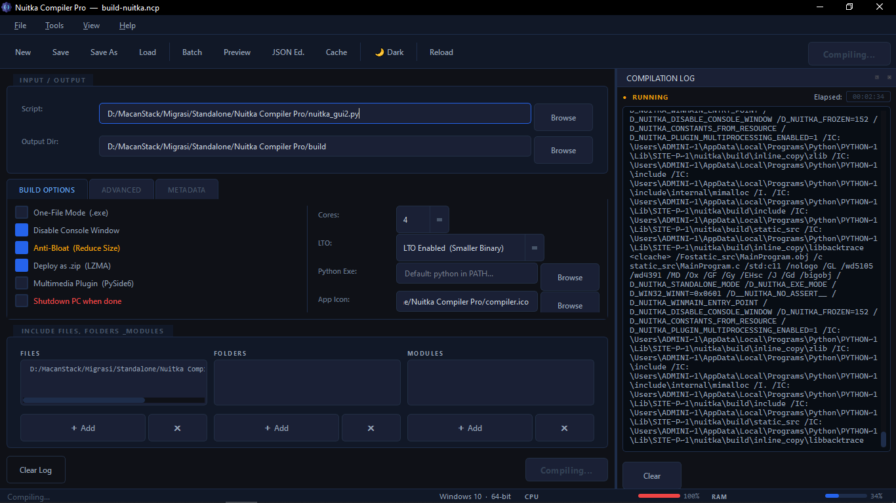
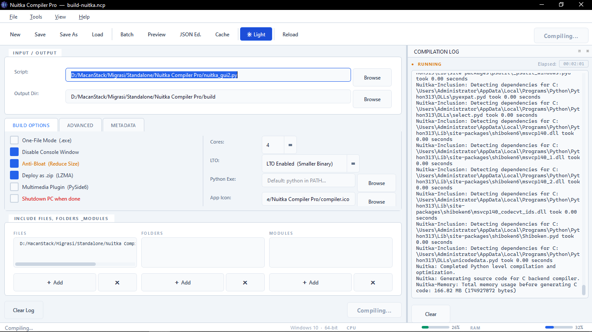

# Nuitka Compiler Pro

<div align="center">



**A professional GUI frontend for the [Nuitka](https://nuitka.net/) Python compiler.**  
Build, package, and deploy Python applications to native executables — without touching the command line.

[](https://github.com/danx123/nuitka-compiler-pro/releases)
[](https://github.com/danx123/nuitka-compiler-pro/releases)
[](LICENSE)

[**Download Latest Release**](https://github.com/danx123/nuitka-compiler-pro/releases/latest) ·  [**Report a Bug**](https://github.com/danx123/nuitka-compiler-pro/issues)

</div>

---

## Overview

Nuitka Compiler Pro wraps the full Nuitka CLI into a clean, profile-driven GUI. Configure once, save as a `.ncp` profile, and compile with a single click — or queue multiple projects in Batch Mode and let the tool handle everything unattended.

Built by a developer who actually uses Nuitka daily. Every feature exists because it solved a real problem.

---

## Screenshots

| Dark Theme | Light Theme |
|:---:|:---:|
|  |  |

---

## Features

### Core Compilation
- **One-File Mode** — produce a single portable `.exe` via `--onefile`
- **Console toggle** — hide or show the terminal window
- **Qt plugin auto-detection** — automatically enables `pyside6`, `pyqt6`, `pyqt5`, or `pyside2` plugin based on import scanning
- **Anti-Bloat** — strips `pytest`, `setuptools`, and `unittest` from the output to reduce binary size
- **Link-Time Optimization (LTO)** — `No LTO`, `LTO Enabled`, or `Thin LTO`
- **MSVC version selector** — target VS 2017, 2019, 2022, or Clang/MinGW
- **Python optimization levels** — `-O` (strip asserts) or `-OO` (strip docstrings)
- **Compilation cores** — configurable parallel jobs up to your CPU thread count

### Build Configuration
- **Output directory** and **filename override**
- **Application icon** (`.ico`)
- **Python executable override** — compile with a specific interpreter
- **Windows version metadata** — Product Name, Version, File Version, Description, Copyright, Trademarks
- **Include files, folders, and modules** — managed via list widgets
- **Extra raw flags** — append any Nuitka flag not covered by the UI

### Post-Compilation
- **Deploy as `.zip` (LZMA)** — compress the output directory or `.exe` automatically after compilation
- **Multimedia Plugin (PySide6)** — copies PySide6 DLLs into the `.dist` folder for One-Directory builds
- **Auto shutdown** — optionally power off the PC when all tasks are complete

### Profile System
- Save and load build configurations as **`.ncp` files** (JSON format)
- **Recent Files** menu with `Ctrl+1` through `Ctrl+9` shortcuts
- **Raw JSON Profile Editor** — built-in editor with syntax highlighting, auto-format, and unsaved-change indicator
- **`.ncp` file association** — register the extension to open profiles directly from Windows Explorer

### Batch Mode
- Queue multiple `.ncp` profiles and compile them sequentially
- **Hardware cooldown** between tasks — configurable 5, 10, or 15 minute delays to protect CPU/RAM thermals
- Reorder the queue with ↑ / ↓ controls
- Optional **auto-shutdown** after batch completion

### Interface
- **Light and Dark themes** — explicit color system, no OS theme inheritance
- **Dockable log panel** — move, float, or close the compilation log independently
- **Live CPU & RAM monitor** in the status bar
- **Elapsed time** counter during compilation
- **Command preview** — inspect the exact Nuitka command before running it
- **Nuitka cache cleaner** — one-click deletion of `clcache` and `module-cache`
- Window layout, dock positions, and theme preference all persisted between sessions

---

## Installation

> **Download the pre-built binary from the releases page.**

1. Go to the [**Releases**](https://github.com/danx123/nuitka-compiler-pro/releases/latest) page


### Requirements

| Requirement | Details |
|---|---|
| **OS** | Windows 10 / 11 (64-bit) |
| **Python** | 3.8 or later (must be in `PATH` or specified manually) |
| **Nuitka** | `pip install nuitka` |
| **C Compiler** | MSVC (via Visual Studio / Build Tools) or MinGW-w64 |

> Nuitka Compiler Pro itself is a standalone executable. Python and Nuitka are only required for the compilation of **your** projects.

---

## Quick Start

1. **Open the app** and select your Python script under **Input / Output**
2. Set an **output directory** (optional — defaults to the script's folder)
3. Choose your options in the **Build Options** tab:
   - Enable **One-File Mode** for a single portable `.exe`
   - Enable **Disable Console** for GUI applications
   - Set **Cores** to match your CPU
4. Fill in **Metadata** (optional but recommended for distribution)
5. Click **▶ Start Compilation**
6. Monitor progress in the **Compilation Log** panel

### Saving a Profile

Hit `Ctrl+S` to save your current configuration as a `.ncp` file. Load it again later with `Ctrl+O` or from the **Recent Files** menu.

### Batch Compilation

1. Save each project as a `.ncp` profile
2. Click **Batch** in the toolbar or press `Ctrl+B`
3. Add profiles to the queue and configure the cooldown strategy
4. Click **Start Batch Processing**

---

## Keyboard Shortcuts

| Shortcut | Action |
|---|---|
| `Ctrl+N` | New / Reset |
| `Ctrl+S` | Save profile |
| `Ctrl+Shift+S` | Save profile as… |
| `Ctrl+O` | Load profile |
| `Ctrl+E` | Open JSON profile editor |
| `Ctrl+B` | Open Batch Manager |
| `Ctrl+P` | Preview Nuitka command |
| `Ctrl+L` | Toggle log panel |
| `Ctrl+T` | Toggle light / dark theme |
| `Ctrl+R` | Reload application |
| `Ctrl+1–9` | Open recent file |
| `F1` | Help |
| `Alt+F4` | Exit |

---

## Profile Format (`.ncp`)

Profiles are plain JSON files and can be edited manually or via the built-in JSON editor (`Ctrl+E`).

```json
{
    "script_path": "C:/Projects/MyApp/main.py",
    "output_dir": "C:/Projects/MyApp/dist",
    "icon_path": "C:/Projects/MyApp/icon.ico",
    "onefile": true,
    "disable_console": true,
    "antibloat": false,
    "lto": "no",
    "jobs": "8",
    "msvc": "latest",
    "python_opt": "",
    "deploy_zip": false,
    "multimedia_plugin": false,
    "shutdown": false,
    "output_filename": "",
    "follow_imports": false,
    "show_scons": false,
    "assume_yes": true,
    "remove_output": true,
    "no_pyc": false,
    "extra_flags": "",
    "product_name": "My Application",
    "product_version": "1.0.0.0",
    "file_version": "1.0.0.0",
    "file_description": "My Application",
    "copyright": "© 2025 My Company",
    "trademarks": "",
    "included_files": [],
    "included_folders": [],
    "included_modules": []
}
```

---

## FAQ

**Q: Does this work with PyQt5 / PyQt6 / PySide2?**  
A: Yes. The app auto-detects which Qt binding your script uses and enables the correct Nuitka plugin automatically.

**Q: Why does my compiled `.exe` crash on another machine?**  
A: Make sure you used **One-Directory mode** (not One-File) when testing, and that all required DLLs are included. For PySide6 apps, enable the **Multimedia Plugin** option. Use `--follow-imports` if modules are missing.

**Q: The compile button does nothing / immediately fails.**  
A: Verify that `python` and `nuitka` are both accessible from the command line. Run `python -m nuitka --version` in a terminal to confirm. If you use a virtual environment, set the Python path in **Build Options → Python Exe**.

**Q: Can I use this on macOS or Linux?**  
A: The distributed binary is Windows-only. Nuitka itself is cross-platform — if you build from the source on other platforms, the core logic should work.

**Q: Where are my profiles stored?**  
A: Anywhere you choose — profiles are saved to the path you specify with `Ctrl+S`. Recent file history and window preferences are stored in the Windows Registry under `HKCU\Software\Danx\NuitkaCompilerPro`.

---

## License

This project is licensed under the [MIT License](LICENSE).

---

<div align="center">

Made with dedication by **Danx — Macan Angkasa**

If this tool saves you time, consider leaving a ⭐ on GitHub.

</div>
